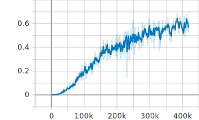

This section contains the codes used for experimenting tensorflow object detection API for face detection.It uses `create_train_records.py` and `create_validation_records.py` for online generation of images containing faces in different contexts. DLIB face landmarks are used for face extraction as opposed to MTCNN inthe other parts. 

The model uses ssd_mobilenet_v1_coco from tensorflow model zoo and the setups should be done with [this](https://github.com/tensorflow/models/blob/master/research/object_detection/g3doc/installation.md) and [this](https://github.com/tensorflow/models/blob/master/research/object_detection/g3doc/running_locally.md) links. For detailed info, consult `train.sh` and `facessd/pipeline.config`.

The performance of this approach was not better that separate detection/classification methods since the pretrained weights are the results of training over general objects, not faces. 

Model's mean average percision after three days of training:

Examples of its performance are as follows:

